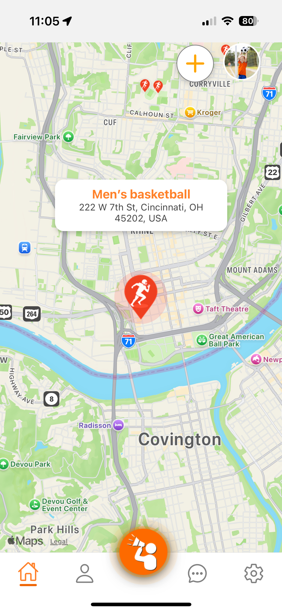
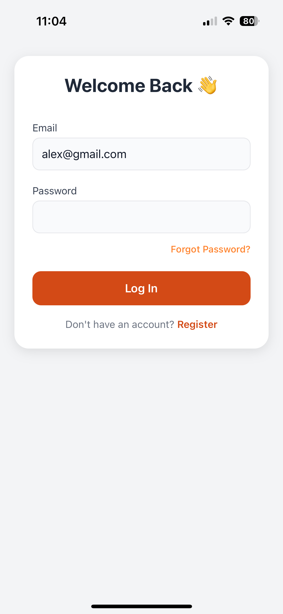
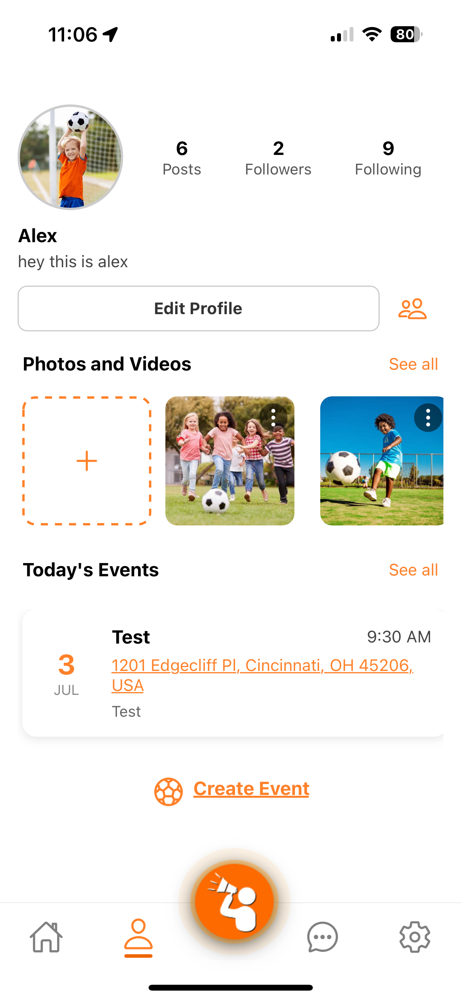
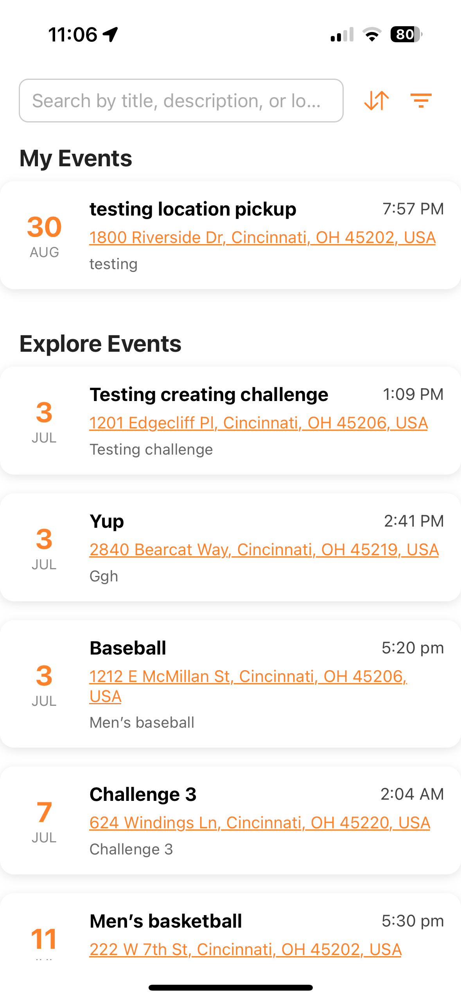
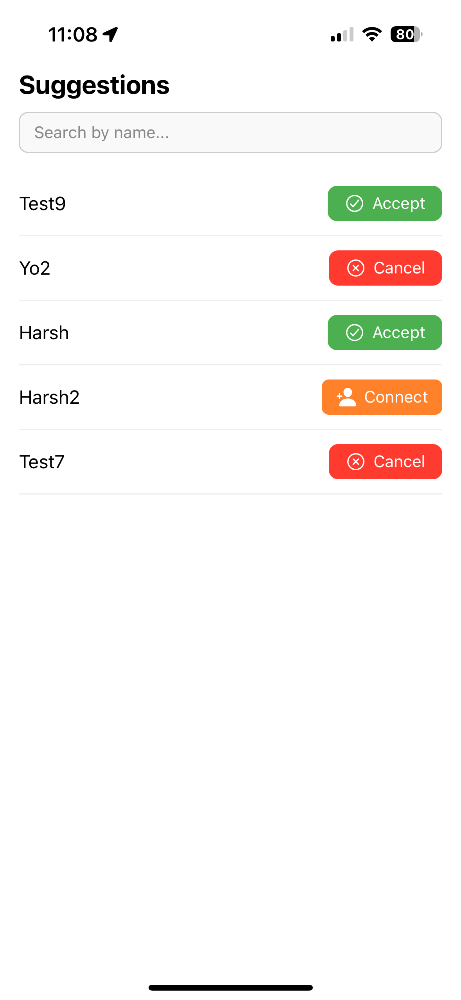
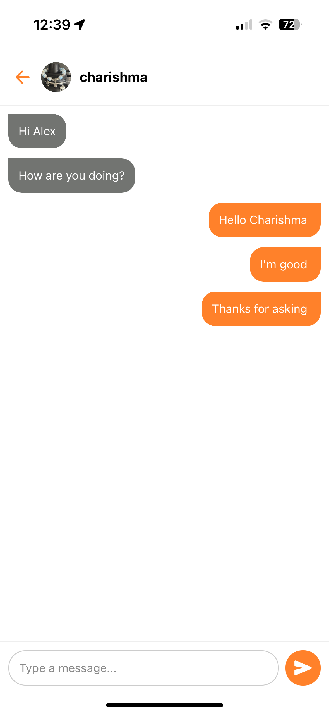

# Playground App

Playground is a social event and chat platform designed for students and communities to connect, organize, and participate in sports and social activities. The app is built with React Native and Firebase, and offers a seamless experience for discovering events, making friends, and sharing media.

---

## Demo Screens

<table>
  <tr>
    <td align="center"><br/>Home Screen</td>
    <td align="center"><br/>Login Screen</td>
    <td align="center"><br/>Profile Screen</td>
  </tr>
  <tr>
    <td align="center"><br/>User Events</td>
    <td align="center"><br/>Suggestions</td>
    <td align="center"><br/>Message Screen</td>
  </tr>
</table>

---

## Features

### 1. **Authentication**

- **Register & Login:** Secure sign up and login using email and password.
- **Password Reset:** Users can reset their password via email.
- **Profile Management:** Users can update their profile, avatar, and bio.

### 2. **Profile**

- **User Info:** View and edit your profile, including name, avatar, and about section.
- **Stats:** See your number of posts, friends (followers), and following (friends + sent requests).
- **Media Preview:** Quick access to your uploaded photos and videos.
- **Today's Events:** See a horizontal scroll of events you are attending or created today.
- **Edit Profile:** Update your profile details and avatar.
- **Connect:** Navigate to the Suggestions screen to find and connect with new friends.

### 3. **Events**

- **Create Event:** Organize new events with title, description, location (with picker), date, time, and game type.
- **Edit/Delete Event:** Edit or delete events you created.
- **Event Details:** View detailed information about any event, including attendees and description.
- **Join Event:** Join events created by others (unless already joined or you are the creator).
- **User Event List:** View all events you are attending or have created.
- **Today’s Events:** See a carousel of today’s events on your profile.
- **Location Picker:** Select a location for your event using a map interface.

### 4. **Map**

- **Home Screen Map:** See all nearby events on a map with interactive pins.
- **Event Popup:** Tap a pin to see event details and navigate to the event page.

### 5. **Chat & Friends**

- **Suggestions:** Discover new users to connect with, send/accept/cancel friend requests.
- **Friends List:** See your connected friends and chat with them.
- **Chat:** Real-time messaging with friends. Only friends can chat with each other.
- **Search:** Search users by name to find and connect.

### 6. **Media**

- **Upload Media:** Add photos and videos to your profile.
- **All Media:** View all your uploaded media in a grid.
- **Edit/Delete Media:** Edit captions or delete your media posts.
- **Post Details:** View, edit, or delete individual media posts.

### 7. **Notifications**

- **Notification Screen:** Placeholder for future notification features.
- **Settings:** Access app settings, help, about, and logout.

---

## Tech Stack

- **React Native** (Expo)
- **Firebase** (Firestore, Auth)
- **React Navigation**
- **React Native Paper** (UI components)
- **Expo Modules** (Image Picker, Location, etc.)

---

## Getting Started

1. **Clone the repository**
2. **Install dependencies**
   ```sh
   npm install
   ```
3. **Set up Firebase**
   - Add your Firebase config to `firebaseConfig.js` or use environment variables.
4. **Run the app**
   ```sh
   npm start
   ```
   or use `expo start`

---

## Folder Structure

- `/screens` - All app screens (Authentication, Profile, Events, Chat, Media, Notifications, Home)
- `/contexts` - React Contexts for Auth and Modal management
- `/navigation` - Navigation stack and tab configuration
- `/assets` - App images and icons
- `/utils` - Utility functions and components

---

## Contributing

Pull requests are welcome! For major changes, please open an issue first to discuss what you would like to change.

---

## License

[MIT](LICENSE)

---

**Enjoy connecting and playing with Playground!**
